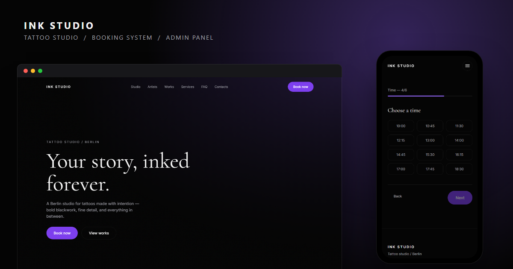
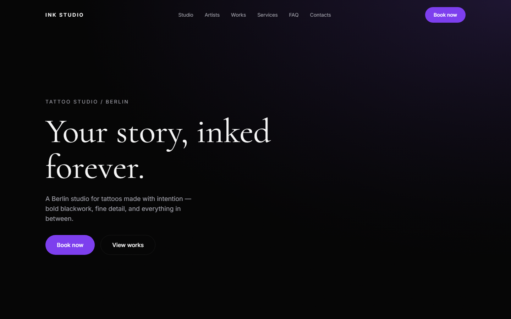
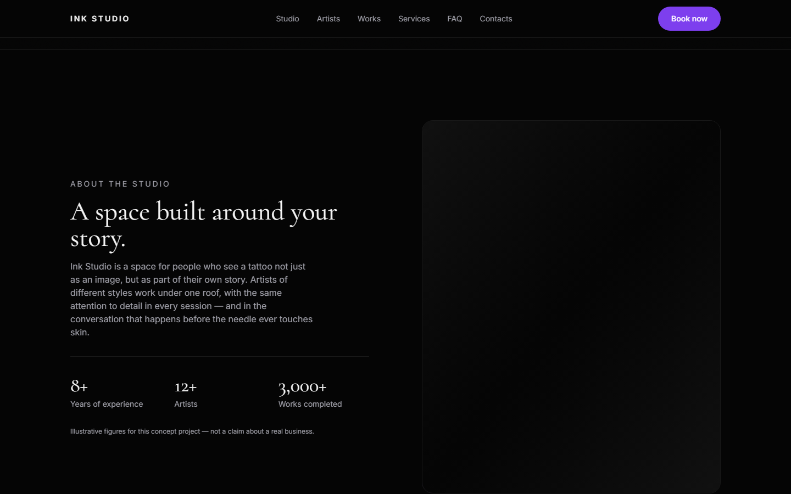
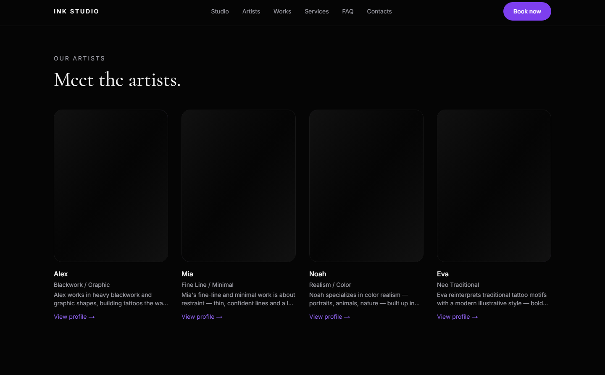
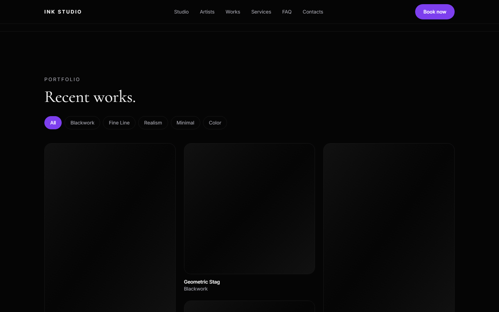
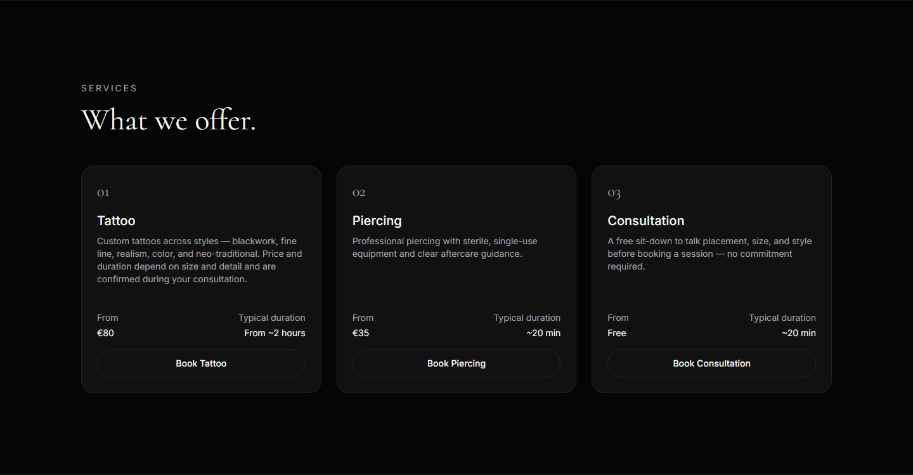
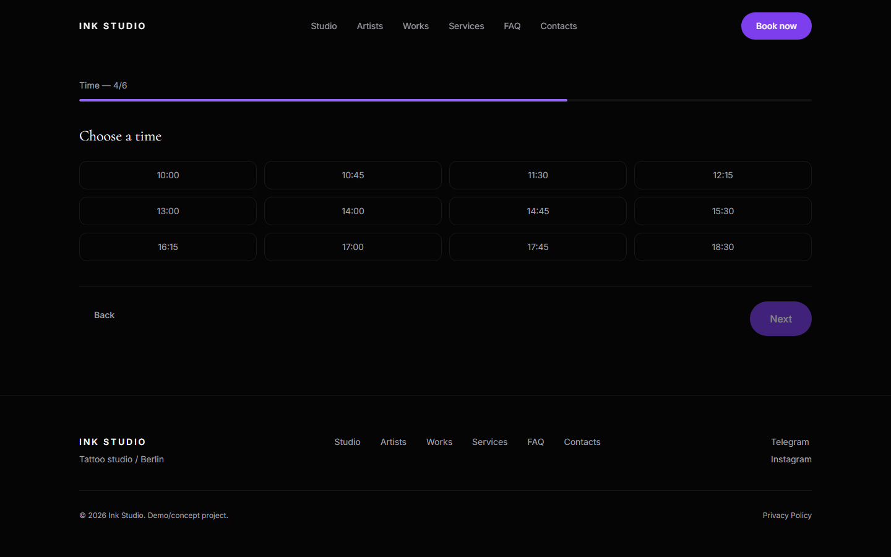
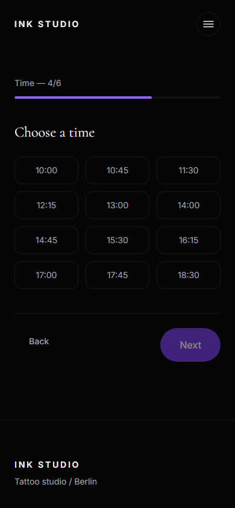
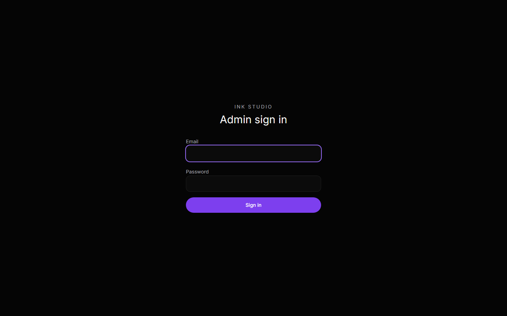
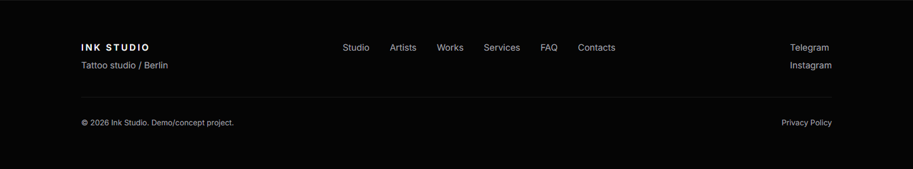

# Ink Studio

A premium tattoo studio website — a demo/concept project built as a portfolio
piece. Bilingual (EN/RU), fully functional booking flow with real-time
availability, an authenticated admin dashboard, and a production deployment.

> **Demo/concept project.** This is a fictional studio built to demonstrate
> full-stack development — not a real business and not client work. See
> [`PROJECT_SPEC.md`](./PROJECT_SPEC.md) for the original brief.

## Preview

**Live site:** https://ink-studio-swart.vercel.app



## Features

- **Bilingual site** (English/Russian) with locale-aware routing, SEO
  metadata, and hreflang alternates
- **6-step booking wizard** — service, artist, date, time (live availability
  from the database), contact details, confirmation — with double-booking
  prevention at the database level
- **Admin dashboard** — authenticated CRUD for artists, services, and
  bookings, protected by Supabase Auth + Row Level Security
- **Telegram notifications** on new bookings
- **Programmatically generated** favicon and Open Graph images (no external
  design tools)
- Dark, motion-forward design system (Tailwind v4 + Motion), with full
  `prefers-reduced-motion` support

## Tech Stack

| | |
|---|---|
| Framework | Next.js 16 (App Router, Turbopack) |
| Language | TypeScript |
| Styling | Tailwind CSS v4 |
| Animation | Motion (Framer Motion) |
| i18n | next-intl |
| Forms/validation | React Hook Form + Zod |
| Backend | Supabase (Postgres, Auth, Row Level Security) |
| Testing | Vitest (unit), Playwright (E2E + accessibility) |
| Deployment | Vercel |

## Architecture

A few decisions worth calling out for anyone reading the code:

- **Two independent root layouts.** The public bilingual site
  (`src/app/[locale]/`) and the English-only admin panel (`src/app/admin/`)
  each have their own root `layout.tsx` — there's no shared top-level
  `app/layout.tsx`, which Next.js explicitly supports.
- **Static generation + ISR, not SSR-on-every-request.** The public pages
  are statically generated and revalidate hourly, with on-demand
  `revalidatePath()` calls from admin mutations for instant updates —
  see [`src/lib/admin/revalidate-public.ts`](./src/lib/admin/revalidate-public.ts).
- **No Supabase client ships to the browser.** All database access happens
  in Server Components and Server Actions; the one feature that used to run
  client-side (checking booked time slots) was moved to a Server Action
  specifically to avoid shipping the Supabase SDK to visitors.
- **RLS does the real access control**, not just the admin route guard —
  every admin Server Action uses the same cookie-scoped, RLS-enforced
  client a logged-out request would get, so authorization isn't just a
  redirect in `proxy.ts`.
- **A `SECURITY DEFINER` Postgres function** (`get_booked_times`) exposes
  only booked time slots to anonymous visitors — never names, phone
  numbers, or comments — with `search_path` explicitly pinned.

## Screenshots

|  |  |
|---|---|
|  |  |
|  |  |
|  |  |
|  |  |
|  |  |

More in [`docs/screenshots/`](./docs/screenshots/).

## Installation

```bash
pnpm install
cp .env.example .env.local   # fill in your own Supabase/Telegram values
pnpm dev
```

Open [http://localhost:3000](http://localhost:3000).

## Environment Variables

See [`.env.example`](./.env.example) for the full list. `SUPABASE_SERVICE_ROLE_KEY`
is listed there but not currently used by the app — every query goes through
the anon key and RLS.

## Database

Apply the migrations in `supabase/migrations/` (in order) via the Supabase
SQL Editor, then optionally run `supabase/seed.sql` and
`supabase/seed-reviews.sql` for sample data.

## Deployment

Deployed on [Vercel](https://vercel.com), connected to this GitHub repo —
every push to `master` triggers an automatic production deployment. Security
headers (CSP, HSTS, etc.), ISR caching, and static generation are configured
in [`next.config.ts`](./next.config.ts) and the individual route files.

## Future Improvements

Honest list of what a real production version would still need:

- Real image storage (Supabase Storage or similar) instead of generated
  placeholder visuals for artist/work photos
- Multiple admin roles/permissions instead of a single shared admin account
- Payment/deposit collection at booking time
- Rate limiting on the public booking endpoint, beyond the honeypot +
  unique-slot constraint
- A richer admin UI for editing bilingual content side-by-side

## Testing

```bash
pnpm test        # Vitest unit tests
pnpm test:e2e     # Playwright E2E — booking flow, admin auth, a11y, etc.
```

## Scripts

| Command | Description |
|---|---|
| `pnpm dev` | Start the dev server |
| `pnpm build` | Production build |
| `pnpm start` | Run a production build locally |
| `pnpm lint` | ESLint |
| `pnpm test` / `pnpm test:watch` | Unit tests |
| `pnpm test:e2e` | End-to-end tests |

## License

MIT
